## sky2syn_week_1
Skywater to Synopsys
<details>
<summary>Week_1</summary>
<details>
<summary>Day_1</summary>
<details>
<summary>Intro to Iverilog</summary> 
    
## Simulation
  ```
Checking of design is done by simulation.
We are going to use iverilog simulator to simulate the design.
```
## Design
    
Design is the actual verilog code or set of verilog codes which has the intended functionality to meet with the required specification.

## Test Bench
```
TB(Test Bench) is used to check whether it obey required specifications or not.
We have to apply stimulus(test_verilog) to the design and have to observe output and check whether it matches with specifications or not.
```
## How Simulation Works

First simulator checks for the changes on the input. Upon change to the input the output is evaluated. If no change to input no change in output.
``` 
 ----------            --------            ----------
|          | Primary  |        |  Primary |          |
|Stimulus  |--------->| Design |--------->|Stimulus  |
| Generator|--------->|        |--------->| Obeserver|
|          |  inputs  |        | outputs  |          |
 ----------            --------            ----------

we have to instantiate Design in TB then we have availability to apply stimulus(test_cases)
Design may have 1 or more primary inputs & outputs
```
## Iverilog Basic Flow
```
   Design--------
                 |
                 |----->Iverilog Simulator---->.vcd file----->gtkwave---->Output Wave form
                 |                              
   Test Bench----

1 We give design and tb to iverilog simulator for checking specifications.
2 iverilog simulator only checks changes in input if there are changes in input we gona dump the chnages in output.
3 .vdc file(Value_Change_Dump format) is a output file which is used to check the changes in the output.
4 gtkwave is used to map the output changes in form of a wave.
```
  </details>
  <details>
<summary>How to use Iverilog and GTKWave</summary>

  ## Getting all files related to Iverilog
  First open terminal and clone git
  ```
$ sudo -i
# go to the directory where you want to paste the librays and verilog codes using git
~# git clone https://github.com/kunalg123/sky130RTLDesignAndSynthesisWorkshop.git
```
We got all verilog files and librarys required to perform iverilog simulation

## Knowing how gtkwave and iverilog works
After cloning the git go to sky130RTLDesignAndSynthesisWorkshop -----> verilog_files directory
```
$sudo -i
#change the directory where sky130RTLDesignAndSynthesisWorkshop file exists
~# cd sky130RTLDesignAndSynthesisWorkshop/ verilog_files/
# in verilog_files we have all design related files and test benches for the respective design file
# now invoking the iverilog
~# iverilog design_file.v tb_design_file.v
# in this we are providing design and testbench of respective design file for simulation
~# ./a.out # for geting .vcd file for checking output
~# gtkwave tb_design_file.vcd # this gives the output wave form

```
## Terminal Overview
```
bhuvan@HP-Pavilion-Plus-Laptop-14-ew0xxx:~$ sudo -i
[sudo] password for bhuvan: 
root@HP-Pavilion-Plus-Laptop-14-ew0xxx:~# cd /home/bhuvan/
root@HP-Pavilion-Plus-Laptop-14-ew0xxx:/home/bhuvan# ls
Bhuvan     Downloads  Public                               sky2syn    Videos
Desktop    Music      README.md                            snap       yosys
Documents  Pictures   sky130RTLDesignAndSynthesisWorkshop  Templates
root@HP-Pavilion-Plus-Laptop-14-ew0xxx:/home/bhuvan# cd sky130RTLDesignAndSynthesisWorkshop/verilog_files/
root@HP-Pavilion-Plus-Laptop-14-ew0xxx:/home/bhuvan/sky130RTLDesignAndSynthesisWorkshop/verilog_files# ls
a.out                    partial_case_assign.v
bad_case_net.v           pattern_detect_fsm_bad_style.v
bad_case.v               pattern_detect_fsm.v
bad_counter.v            rca.v
bad_latch_2.v            ripple_counter.v
bad_latch_net.v          tb_bad_case.v
bad_latch.v              tb_bad_counter.v
bad_mux_net.v            tb_bad_latch2.v
bad_mux.v                tb_bad_latch.v
bad_shift_reg2.v         tb_bad_mux.v
bad_shift_reg.v          tb_bad_shift_reg2.v
blocking_caveat_net.v    tb_bad_shift_reg.v
blocking_caveat.v        tb_blocking_caveat.v
comp_case.v              tb_comp_case.v
counter_opt2.v           tb_counter_opt.v
counter_opt.v            tb_demux_case.v
demux_case.v             tb_demux_generate.v
demux_generate.v         tb_dff_asyncres_syncres.v
dff_ares.net.v           tb_dff_asyncres.v
dff_asyncres_net.v       tb_dff_async_set.v
dff_asyncres_syncres.v   tb_dff_const1.v
dff_asyncres.v           tb_dff_const2.v
dff_async_set.v          tb_dff_const3.v
dff_const1.v             tb_dff_const4.v
dff_const2.v             tb_dff_const5.v
dff_const3.v             tb_dff_syncres.v
dff_const4.v             tb_good_counter.v
dff_const5.v             tb_good_latch.v
dff_net.v                tb_good_mux.v
dff_syncres.v            tb_good_mux.vcd
fa.v                     tb_good_shift_reg.v
good_counter.v           tb_incomp_case.v
good_latch.v             tb_incomp_if2.v
good_mux_netlist.v       tb_incomp_if.v
good_mux.v               tb_multiple_modules.v
good_shift_reg.v         tb_mux_generate.v
incomp_case.v            tb_opt_check2.v
incomp_if2.v             tb_opt_check3.v
incomp_if.v              tb_opt_check.v
mul2_net.v               tb_partial_case_assign.v
mult_2.v                 tb_pattern_detect_fsm.v
mult_8.v                 tb_rca.v
multiple_module_opt2.v   tb_ripple_counter.v
multiple_module_opt.v    tb_ternary_operator_mux.v
multiple_modules_flat.v  tb_upcntr.v
multiple_modules_hier.v  tb_up_dn_cntr.v
multiple_modules.v       tb_up_dn_cntr_with_load.v
mux_generate.v           tb_up_dn_cntr_with_load_with_start_stop.v
mux_spice.v              ternary_operator_mux_net.v
net.v                    ternary_operator_mux.v
opt_check2.v             upcntr.v
opt_check3.v             up_dn_cntr.v
opt_check4.v             up_dn_cntr_with_load.v
opt_check.v              up_dn_cntr_with_load_with_start_stop.v
root@HP-Pavilion-Plus-Laptop-14-ew0xxx:/home/bhuvan/sky130RTLDesignAndSynthesisWorkshop/verilog_files# iverilog good_mux.v tb_good_mux.v 
root@HP-Pavilion-Plus-Laptop-14-ew0xxx:/home/bhuvan/sky130RTLDesignAndSynthesisWorkshop/verilog_files# ./a.out 
VCD info: dumpfile tb_good_mux.vcd opened for output.
root@HP-Pavilion-Plus-Laptop-14-ew0xxx:/home/bhuvan/sky130RTLDesignAndSynthesisWorkshop/verilog_files# gtkwave tb_good_mux.vcd 
Gtk-Message: 23:59:17.901: Failed to load module "canberra-gtk-module"

GTKWave Analyzer v3.3.104 (w)1999-2020 BSI


(gtkwave:10340): dconf-WARNING **: 23:59:17.916: failed to commit changes to dconf: Failed to execute child process ?dbus-launch? (No such file or directory)
[0] start time.
[300000] end time.

(gtkwave:10340): dconf-WARNING **: 23:59:18.099: failed to commit changes to dconf: Failed to execute child process ?dbus-launch? (No such file or directory)

(gtkwave:10340): dconf-WARNING **: 23:59:18.099: failed to commit changes to dconf: Failed to execute child process ?dbus-launch? (No such file or directory)
```

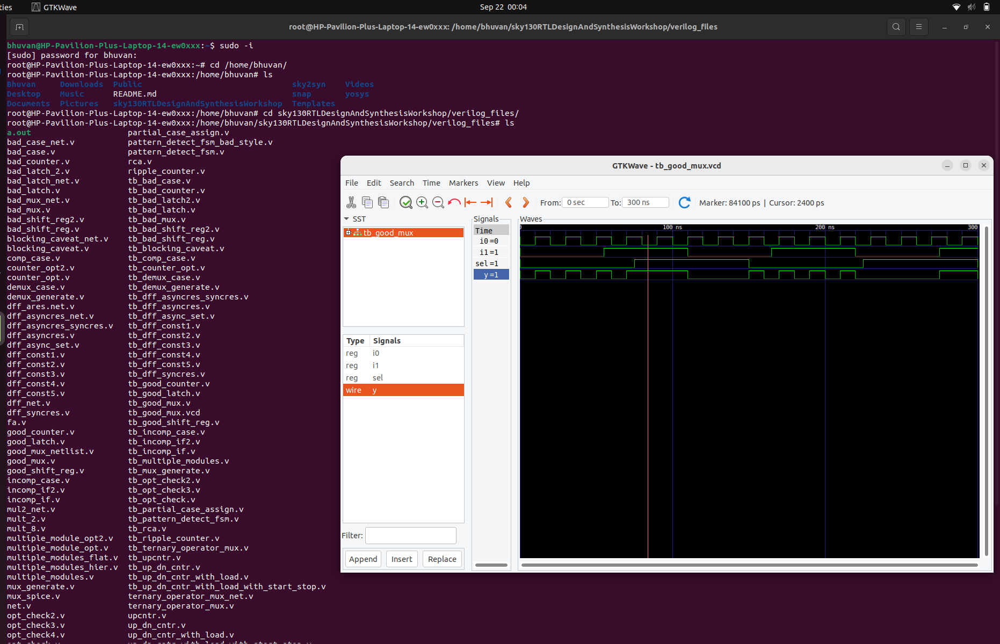


</details>

<details>
<summary>Checking the Desing and Test Bench</summary>

## Checking the code
To check the design code and testbench code first open terminal and go to the directory where the related files are present and run the below commands
```
$ sudo -i
~# cd /home/bhuvan/sky130RTLDesignAndSynthesisWorkshop/verilog_files/
~# gvim -O good_mux.v tb_good_mux.v
```
This gives the verilog design code and testbench code


</details>

<details>
<summary>What is yosys</summary>

## yosys
Now we are going to use yosys which is the synthesizer used to convert RTL to netlist

## yosys setup
```
     ------------
    |Read_verilog|
     ------------   
       /                                 -------------
     /                                  |Write_verilog|
 --------                                -------------
|        |                                 /
| Design |------                         /  
|        |      |      -------        -------
 --------       |     |       |      |       |
                |---->| Yosys |----->|netlist|
 --------       |     |       |      |  file |
|        |      |      -------        -------
|  .lib  |------
|        |
 --------
    \  
      \
  ------------
 |Read_liberty|
  ------------
```

Read_verilog command to read the design and read_liberty command to read .lib file and write_verilog to write the netlist file. Once we execute the comand write_verilog we get the netlist output. Both netlist and design are same but Netlist is repreasentation of Design in the form cells present in the .lib.

## Verify the synthesis

The out put of the Iverilog basic flow which has Design code otput(RTL simulation) should be same as the netlist code output(synthesized output).
```Courses
   NETLIST-------
                 |
                 |----->Iverilog Simulator---->.vcd file----->gtkwave---->Output Wave form
                 |                              
   Test Bench----
```
So the set of primary inputs or outputs will remain same between the RTL design and synthesized netlist which means the same test bench can be used for both the Dsign and Netlist codes. 

## Logic synthesis
RTL Design:
Behavioral representation of the required specification
```
module sample_code (                                         --------- 
input clk,rst, output result, done);                        |         |
always @ (posedge clk, posedge rst)                  ------>| D       |
if(rst)                                                     |         |------->Q
------                                               ------>|> clk    |
else                                                        |         |
------                                               ------>|  Reset  |               
endmodule                                                    ---------    
----------------------------------
       RTL Code                                          Digital Logic Circuit                         
```
Basically we dont want RTL code we wnat Logical circuit we map these two in the form of Synthesis. 
```
In synthesis the RTL code is translated into Gate level.                                    RTL    Frount End lib
The design is converted into gates and the connections are made between gates.               |___________| 
This is given a output file which is called netlist file.                                          |
                                                                                               synthesis
                                                                                                   | 
                                                                                                NETLIST
```
## What is .lib
```
.lib
This Collection of logical modules.
Includes basic logic gates like And, Or, Not, etc...
This has Different flavors of same gate
  2 input And gate which has
    Slow version
    Medium version
    Fast version
  3 input And gate also
    Slow version
    Medium version
    Fast version
4 input And gate
........so on
```
## Why use of different versions or flavours of gates
Combinational delay in logic path determines the maximum speed of operation of digital logic circuit
```
         ---------                    --------
        |         |                  |         |
        |         |----> combib ---->|         |      ___     ___     ___     ___
        |  D-FF A |                  |  D-FF B |    _|   |___|   |___|   |___|   |___ 
        |         |                  |         |    <--Tclk-->
        |         |                  |         |             propogation delay of comb  
 ------>|> clk    |               -->|> clk    |     TCLK > TCQ A + TCOMBI + TSETUP_B
    |    ---------               |    ---------        propogation delay of flop A                                    
    |____________________________|

```
The time taken for the clock to go from A to B is 1 clk cycle. We can't give the clock at same time for both FF because there might be chances of loss of data so we have to add a small delay which is called SETUP delay ot FF B by combining all of this the delay should be minimum for higher frequency  fclk_max = 1/clk_min. so for better performance dilay should be as less as possible. So we need cells that work fast to make TCOMBI Small. This where different types of versions of gates comes in to implementation.

## Need of slow cells

```
         ---------                    --------
        |         |                  |         |
        |         |----> combib ---->|         |      ___     ___     ___     ___
        |  D-FF A |                  |  D-FF B |    _|   |___|   |___|   |___|   |___ 
        |         |                  |         |       1       2       3       4  
        |         |                  |         |      THOLD_B < TCQ_A + TCOMBI           
 ------>|> clk    |               -->|> clk    |     
    |    ---------               |    ---------                                          
    |____________________________|
```
When A FF is launched at 1 then B should not capture the launched signal at 1 the b should be captured at 2 as there is possibility of loss of data. The combination of the delay of FF A and Combi should be greater than the Hold of B which helps in the condition which we disscused before for this the slow cells comes into image which helps to provide dely required. Simply to ensure that there are no hold voilations at B FF we cells that work slow. Hence we need cells that work fast to meet the required performance and cells that work slow to meet HOLD. This collection of fast and slow cells is present in .lib 

## Fast vs Slow

Load in Digital Logic circuit is Capacitance
```
Gate A -----> Gate B
```
IF the capacitance between the gates is large than it take time to charge and progation delay at B gate increases and if capacitor is small the cahrge time will be less so teh propogation delay is less simply Faster the charging / discharging of capacitance Lesser the cell delay
```
To charge / discharge the capacitance fast, we need transistors capable of sourcing more current means wide transistors
Wider transistors -> Low Delay -> More Area and Power as well !!
Narrow transistors -> More Delay -> Less Area and Power
Faster cells donot come free, they come at penalty of area and power
```
## selection of cells
```
Need to guide the Synthesizer to select the flavour of cells that is optimum for the implementation of logic circuit
More use of faster cells --> Bad circuit interms of Power and Area and Hold time violations 
More use of slower cells --> Sluggish circuit, may not meet the performance need
The guidance offered to the Synthesizer --> "Constraints"
```
## synthesis Illustration
```
  ------------------------------------
 | module (A, B,sel, clock, reset, Q) |                   ----------------------------------   
 | input A, B,sel, clock, reset;      |----------------->|                                  |
 | output Q;                          |                  |                                  |
  ------------------------------------                   |    |\                            |
  wire int;                                           B  |    |  \                          |
  -------------------------                        ----->|--->|I0  \                        |
 | assign int = sel ? A:B; |-----------------------------|--->|     |                       | 
  -------------------------                              |    |    Y|-----                  |
  ------------------------------------------          A  |    |     |     |     ------      |
 | always @(posedge clock or posedge reset) |      ----->|--->|I1  /      |    |      |     | 
 |  begin                                   |            |    |  /         --->|D     |     |
 |   if (reset)                             |            |    |/  |        --->|>clk q|---->|----->Q
 |   begin                                  |       Sel  |        |       |    |      |     |
 |      Q <= 1'b0;                          |      ----->|--------        |  ->|res   |     |
 |   end                                    |            |                | |   ---|--      |
 |   else if (clk)                          |      ----->|----------------  |      |        |
 |   begin                                  |      clock |                  |      |        |
 |      Q <= int;                           |      reset |                  |      |        |
 |   end                                    |      ----->|------------------       |        |
 |  end                                     |------------|-------------------------         |
  ------------------------------------------              ----------------------------------
endmodule
```
Module map to the top level. Assign block is used for making mux in the main block where output of mux is connected to the D FF. Finally the assign block is used for the D FF and Q output is connected to the main block. The circuit on the right is created from RTL using the gates in the .lib and give out as Netlist.

</details>

<details>
<summary>Introduction to synthesiser</summary>

## yosys
To convert RTL to Netlist follow the commands.
```
$ sudo -i
# change directory where the yosys has been installed
# yosys
read_liberty -lib ../lib/sky130_fd_sc_hd__tt_025C_1v80.lib
# to read the library
read_verilog module_name.v
# there should be no error
synth -top module_name
abc -liberty ../lib/sky130_fd_sc_hd__tt_025C_1v80.lib 
# this covert rtl file to gate level net list and .lib is used to specify the what type of gate to be used
show
#this show graphical version of netlist
```


## Check netlist

To check net list run below commands
```
write_verilog good_mux_netlist.v 
!gvim good_mux_netlist.v
# This give all the text which is not use full so run
write_verilog -noattr good_mux_netlist.v
# eliminate un wanted things
!gvim good_mux_netlist.v
```
```
yosys> write_verilog good_mux_netlist.v 

7. Executing Verilog backend.

7.1. Executing BMUXMAP pass.

7.2. Executing DEMUXMAP pass.
Dumping module `\good_mux'.

yosys> !gvim good_mux_netlist.v 

8. Shell command: gvim good_mux_netlist.v
QStandardPaths: XDG_RUNTIME_DIR not set, defaulting to '/tmp/runtime-root'

yosys> QStandardPaths: XDG_RUNTIME_DIR not set, defaulting to '/tmp/runtime-root'


yosys> write_verilog -noattr good_mux_netlist.v 

9. Executing Verilog backend.

9.1. Executing BMUXMAP pass.

9.2. Executing DEMUXMAP pass.
Dumping module `\good_mux'.

yosys> !gvim good_mux_netlist.v 

10. Shell command: gvim good_mux_netlist.v
QStandardPaths: XDG_RUNTIME_DIR not set, defaulting to '/tmp/runtime-root'

yosys> QStandardPaths: XDG_RUNTIME_DIR not set, defaulting to '/tmp/runtime-root'


yosys> exit
```

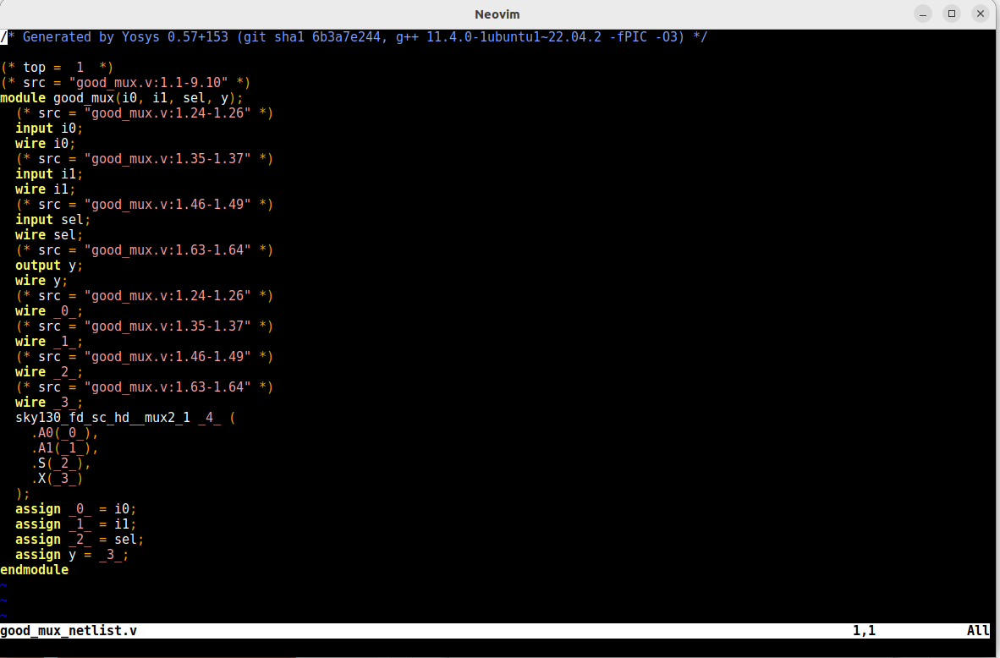


</details>
</details>
<details>
<summary>Day_2</summary>
<details>
<summary>About .lib</summary>

## What .lib contains

P(process) V(voltage) T(temperature) plays a main role for a design to work. \
Process     -> variation due to fabrication \
voltage     -> variation due to voltage \
Temperature -> variation due to temperature \
Variation in PVT determine how the silicon is gona work like it is gona work faster or slower so we can not make a device every time with same specifications there will be minimal changes in the circuit so this small variations determine how the circuit is going to work. 
```
library ("sky130_fd_sc_hd__tt_025C_1v80") {
    define(def_sim_opt,library,string);
    define(default_arc_mode,library,string);
    define(default_constraint_arc_mode,library,string);
    define(driver_model,library,string);
    define(leakage_sim_opt,library,string);
    define(min_pulse_width_mode,library,string);
    define(simulator,library,string);
    define(switching_power_split_model,library,string);
    define(sim_opt,timing,string);
    define(violation_delay_degrade_pct,timing,string);
    technology("cmos");
    delay_model : "table_lookup";
    bus_naming_style : "%s[%d]";
    time_unit : "1ns";
    voltage_unit : "1V";
    leakage_power_unit : "1nW";
    current_unit : "1mA";
    pulling_resistance_unit : "1kohm";
    capacitive_load_unit(1.0000000000, "pf");
    revision : 1.0000000000;
    default_cell_leakage_power : 0.0000000000;
    default_fanout_load : 0.0000000000;
    default_inout_pin_cap : 0.0000000000;
    default_input_pin_cap : 0.0000000000;
    default_max_transition : 1.5000000000;
    default_output_pin_cap : 0.0000000000;
    default_arc_mode : "worst_edges";
    default_constraint_arc_mode : "worst";
    default_leakage_power_density : 0.0000000000;
    default_operating_conditions : "tt_025C_1v80";
    operating_conditions ("tt_025C_1v80") {
        voltage : 1.8000000000;
        process : 1.0000000000;
        temperature : 25.000000000;
        tree_type : "balanced_tree";
    }
    power_lut_template ("power_inputs_1") {
        variable_1 : "input_transition_time";
        index_1("1, 2, 3, 4, 5, 6, 7");
    }
```
IN this sky130_fd_sc_hd__tt_025C_1v80 \
tt stand for typical process \
025C stand for 25c temperature \
1v80 indicates 1.8v voltage. 

technology("cmos"); \
This tells what kind of technology we are going to use. In this we are using CMOS technology.

    time_unit : "1ns"; -------------------------> units of time in nano sec 
    voltage_unit : "1V";------------------------> units of voltage in volts 
    leakage_power_unit : "1nW";-----------------> units of power in nano whatt 
    current_unit : "1mA";-----------------------> units of current in milli amps
    pulling_resistance_unit : "1kohm";----------> units of resistance in kilo ohm
    capacitive_load_unit(1.0000000000, "pf");---> units of capacitance in peco farade 

   operating_conditions ("tt_025C_1v80") { ---> Tells the oeration conditions \
        voltage : 1.8000000000;---------> Voltage 1.8 \
        process : 1.0000000000;---------> process tt \
        temperature : 25.000000000;-----> temp 25 \
        tree_type : "balanced_tree"; \
   }

## Lets check the different two input and gates

  ```
   cell ("sky130_fd_sc_hd__and2_0") {  // there are 2 inputs which means 4 possible out comes                                                       
        leakage_power () {
            value : 0.0021372000;                                                              
            when : "!A&B";  // A is low  and B is high                                                  
        }
        leakage_power () {
            value : 0.0018183000;                                                                     
            when : "!A&!B";  // A is low  and B is low                                                  
        }
        leakage_power () {
            value : 0.0015938000;                                                             
            when : "A&B";    // A is high  and B is high                                                   
        }
        leakage_power () {
            value : 0.0021392000;                                                              
            when : "A&!B";   // A is high  and B is low         
```
   
  From the above image 0, 2, 4 indicates different flavour of a 2 input and gate
  From the above the parrameters varry from 0 to 4 \
  For 0 area consumtion is less compare to 4. Which means 4 has wider transistor. \
  wider cells (4) are faster but consume large amount of power and large area. But for smaller cells (0) delay more area consumed is less
```
 --------------------------------------------------------------------------------
|      parameters      |       and2_0      |      and2_2      |      and2_4      |   
| ---------------------|-------------------|------------------|------------------|
| Size of the cells    |   Smaller cells   |   Medium cells   |   Wider cells    |  
| Power consumtion     |   Small amount    |   Medium amount  |  Larger amount   |  
| Delay                |   More delay      |   Medium delay   |   Large delay    |
 --------------------------------------------------------------------------------
```
</details>
<details>
<summary>Hierarical and Flat</summary>

## Hierarical synthesis and flat synthesis

```
module sub_module2 (input a, input b, output y);
        assign y = a | b;
endmodule

module sub_module1 (input a, input b, output y);
        assign y = a&b;
endmodule


module multiple_modules (input a, input b, input c , output y);
        wire net1;
        sub_module1 u1(.a(a),.b(b),.y(net1));  //net1 = a&b
        sub_module2 u2(.a(net1),.b(c),.y(y));  //y = net1|c ,ie y = a&b + c;
endmodule

        SUB MODULE 1 --> U1
            ------
A ---------|       \          \------\                    
           |        |-----------\      \
B ---------|       /             \       \__________ Y
            ------               /       /
C ------------------------------/       /
                               /-------/
                            SUB MODULE 2 --> U2
```
when we executes in yosys the show out put should be as shown above but we are getting the output as shown below so this what we call Hierarchy synthesis which does not show and and or gates it shows instants u1 and u2. This is because we are using CMOS it chose the NAND implementation which has a stacked NMOS but for NOR stacked PMOS is done so this stacking of PMOS is always bad so we include NAND.


</details>
<details>
<summary>Flops</summary

## Why Flops
```

               Propogation delay
     |-------------------------------------|                            2ns |
     V      ------                         |                           __|__|_________
A ---------|       \     i     \------\    |                A ________|  |  |
           |        |-----------\      \   V                           __|__|_________
B ---------|       /             \       \__________ Y      B ________|  |  |
            ------               /       /                    ________   |  |
C ------------------------------/       /                   C         |__|__|_________
      Delay of AND 2ns        /-------/                       ___________|  |   ______
                            Delay of OR 1ns                 Y         1ns|__|__|<----------Glitch
                                                                         |__|_________
                                                            i ___________|  |
                                                                         |  |
```
                                                                        
There will be a propogation delay from input to the output this causes a glitch in the output. \
when C goes high the or takes instantely and generate output. \
But when C goes low but output takes 1ns to go low from high as the delay is of 1ns as or takes the input instantly. \
i goes low as starting is low but when A and B goes high the output goes high only after 2ns delay of AND gate. \
After i goes high it get feeded to the OR and both C and i perform addition ad produce output after 1ns of delay of OR gate. \
The low to high due to delay causes the glitch as main working is the out should be constant high but due to this delay the output is glitching

so for multiple combinations there will be bigger gliches

```
  ----------       ----------                       ----------
 | Comb ckt |---->| Comb ckt |---->......soon----->| Comb ckt |----> /\/\/\/\/\                      
  ----------       ----------                       ----------
```
This n no of combinational circuit causes large amount of gliches. \
so to avoid this we include flops which helps to store the data and when there is a high only then output is moved but when there is low it stores the data and passes when only high.

## D_FF

## Asynchronous Reset

```
module dff_asyncres (                                         
input clk,input async_reset,input d,                          ---------
output reg q);                                               |         |            
always @ (posedge clk, posedge async_reset)                  |         |           
begin                                                 ------>| D       |
if(async_reset)                                              |         |------->Q
q <= 1'b0;                                            ------>|> clk    |
else                                                         |         |
q <= d;                                                      |         |
end                                                   ------>|  Reset  |               
endmodule                                                     ---------    

```
From above code at posedge of reset irrespect of the the clock the output q is going low as if is prioritised. But if reset is at negedge if block is skiped and else block is executed for every posedge of clk where input d is same as output q. 

```
Lets see the clk signal
                                            ________________
 async_reset ______________________________|
               __    __    __    __    __  | __    __    _  
clk         __|  |__|  |__|  |__|  |__|  |_||  |__|  |__|
                 ______          __________|__
d          _____|      |________|          |  |_____________  
                 ______          __________|
q          _____|      |________|          |_______________

```
Irrespective of the clock when the reset goes high output goes low this is async flipflop.
```
# THIS IS GTKWAVE FORMAT TO LOOK OUTPUT
root@HP-Pavilion-Plus-Laptop-14-ew0xxx:/home/bhuvan/sky130RTLDesignAndSynthesisWorkshop/verilog_files# iverilog dff_asyncres.v tb_dff_asyncres.v
root@HP-Pavilion-Plus-Laptop-14-ew0xxx:/home/bhuvan/sky130RTLDesignAndSynthesisWorkshop/verilog_files# ./a.out 
VCD info: dumpfile tb_dff_asyncres.vcd opened for output.
root@HP-Pavilion-Plus-Laptop-14-ew0xxx:/home/bhuvan/sky130RTLDesignAndSynthesisWorkshop/verilog_files# gtkwave tb_dff_asyncres.vcd
Gtk-Message: 17:16:41.636: Failed to load module "canberra-gtk-module"

GTKWave Analyzer v3.3.104 (w)1999-2020 BSI
```
GTKwave


Synthesis
```
#commands for synthesis
sudo -i
#change the directory to where the verilog file is there
cd /home/bhuvan/sky130RTLDesignAndSynthesisWorkshop/verilog_files/
yosys
read_liberty -lib ../lib/sky130_fd_sc_hd__tt_025C_1v80.lib
read_verilog dff_asyncres.v
synth -top dff_asyncres
dfflibmap -liberty ../lib/sky130_fd_sc_hd__tt_025C_1v80.lib 
#specifing the dff lib for maping instead of logic gates
 abc -liberty ../lib/sky130_fd_sc_hd__tt_025C_1v80.lib
show
```
Synthesis Diagram

## Asynchronous set
```
module dff_asyncset (                                         
input clk,input async_set,input d,                            ---------
output reg q);                                               |         |            
always @ (posedge clk, posedge async_set)                    |         |           
begin                                                 ------>| D       |
if(async_set)                                                |         |------->Q
q <= 1'b1;                                            ------>|> clk    |
else                                                         |         |
q <= d;                                                      |         |
end                                                   ------>| set     |               
endmodule                                                     ---------    

```
We are seting the q to 1 when there is async set is high irrespective of clk


```
Lets see the clk signal
                                            ________________
 async_set   ______________________________|
               __    __    __    __    __  | __    __    __  
clk         __|  |__|  |__|  |__|  |__|  |_||  |__|  |__|  |_
                 ______          __________|__
d          _____|      |________|          |  |_____________  
                 ______          __________|________________
q          _____|      |________|          |

```
 In this irrespective of clock if async set is high output is high.
```
# THIS IS GTKWAVE FORMAT TO LOOK OUTPUT
root@HP-Pavilion-Plus-Laptop-14-ew0xxx:/home/bhuvan/sky130RTLDesignAndSynthesisWroot@HP-Pavilion-Plus-Laptop-14-ew0xxx:/home/bhuvan/sky130RTLDesignAndSynthesisWorkshop/verilog_files# iverilog dff_async_set.v tb_dff_async_set.v
root@HP-Pavilion-Plus-Laptop-14-ew0xxx:/home/bhuvan/sky130RTLDesignAndSynthesisWorkshop/verilog_files# ./a.out 
VCD info: dumpfile tb_dff_async_set.vcd opened for output.           
root@HP-Pavilion-Plus-Laptop-14-ew0xxx:/home/bhuvan/sky130RTLDesignAndSynthesisWorkshop/verilog_files# gtkwave tb_dff_async_set.vcd
Gtk-Message: 17:26:14.164: Failed to load module "canberra-gtk-module"

GTKWave Analyzer v3.3.104 (w)1999-2020 BSI
```
GTKwave


Synthesis Diagram


## sync_reset
```
module dff_syncreset (                                         
input clk,input sync_reset,input d,                 
output reg q);                                                 
always @ (posedge clk)                     
begin                                              
if(sync_reset)                                      
q <= 1'b1;                                         
else                                               
q <= d;                                            
end                                                       
endmodule       

      |\                            
      |  \                                
D---->|I0  \                                                                          ___|____________
      |     |                             sync_reset  _______________________________|   |   
      |    Y|-----                                       __    __    __    __    __    __|   __    __   
      |     |     |     ------            clk         __|  |__|  |__|  |__|  |__|  |__|  |__|  |__|  |_ 
1'b0->|I1  /      |    |      |                            ______          ___________   |     _______
      |  /|       |--->|      |           d          _____|      |________|           |__|____| 
      |/  |        --->|>clk  |----> q                     ______          ___________
          |            |      |           q          _____|      |________|           |_______________ 
      Sync_reset       |      |     
                        ------
```
Sync_reset waits for the clock and then only if reset is low output is same as input and if reset is high it wait for the positive edge of clk then the output goes low
```
# THIS IS GTKWAVE FORMAT TO LOOK OUTPUT
root@HP-Pavilion-Plus-Laptop-14-ew0xxx:/home/bhuvan/sky130RTLDesignAndSynthesisWorkshop/verilog_files# iverilog dff_syncres.v tb_dff_syncres.v
root@HP-Pavilion-Plus-Laptop-14-ew0xxx:/home/bhuvan/sky130RTLDesignAndSynthesisWorkshop/verilog_files# ./a.out 
VCD info: dumpfile tb_dff_syncres.vcd opened for output.
root@HP-Pavilion-Plus-Laptop-14-ew0xxx:/home/bhuvan/sky130RTLDesignAndSynthesisWorkshop/verilog_files# gtkwave tb_dff_syncres.vcd
Gtk-Message: 17:32:37.282: Failed to load module "canberra-gtk-module"

GTKWave Analyzer v3.3.104 (w)1999-2020 BSI
```
GTKwave


Synthesis Diagram


similarly for syncset and reset it executes only for pos edge of clock if the reset is low else the output will be low irrespect of clock.
</details>
</details>
<details>
<summary>Day_3</summary>
<details>
<summary>Introduction to optimisation</summary>

## Combinational logic optimisation

Optimisation is bascially used to get best or most effective output. \
Squeezing the logic to get the most optimised design in terms of area and power saving. Commonly used optimisation techniques are:  \
1.Constant propagation using direct optimisation. \
```
            ------
A -------->|       \          \------\                                           
           |        |---------->\      \                                             |\
B -------->|       /             \       \             Y = ((AB)+C)'                 |  \ 
            ------                )       ) O----> Y   if A = 0             C------->|   )O--------> Y 
           AND GATE              /       /             Y = ((0)+C)'                  |  /         
C ----------------------------->/       /                                            |/
                               /-------/
                               NOR GATE                                          NOT GATE

The big logic gate is compressed into a not gate 
 
                 ___ Vdd                    
                  |
            ______|______                                                    
         __|           __|                         
A ----o||__    B ---o||__                         _____ Vdd  
           |_____________|                          |
                __|                               __|
        C ---o||__                          ---o||__
                  |                        |        |
                  |----------- Y  =>  C ---|        |----- Y      
           _______|_______                 |      __|          
         __|             |                  ----||__      
A -----||__              |                          |
           |           __|                        __|__
         __|   C ----||__                          GND  
 B -----|__              |          
           |_____________|              
                __|__                        
                 GND 
                 
The 6 MOS transistors is minimize to 2 MOS transistor
 ```                
2. Boolean logic optimisation using K-Map and Quine McKluskey.  
```
assign Y = a?(b?c:(c?a:0)):(!c)

      |\                          |\  
      |  \                        |  \       
0---->|0   \      |\        C'--->|0   \                                           
      |     |     |  \            |     |
      |   Y0|---->|0   \          |    Y|----> Y = A'c'+A[BC+B'AC] 
      |     |     |     |         |     |
A---->|1   /      |   Y1|-------->|1   /
      |  /|       |     |         |  /| 
      |/  |   C-->|1   /          |/  |   
          |       |  /|               |
          C       |/  |               A
                      |           
                      B   
 ```                     
This is the logcal diagram for the assign but this is not optimised where we used complex circuits when we minimize the Y we get A'C'+AC which is basically a xnor gate output this how the Boolean optimisation is done
```

            
            \ \------\                                           
A ----------->\ \      \
               \ \       \           
                ) )       ) O----> Y = A'C'+AC  
               / /       /                   
C ---------->/ /       /
            / /-------/
            XNOR GATE              
```
such a complicated assign Y = a?(b?c:(c?a:0)):(!c) expression is simplified to a simple Y = A'C'+AC  boolean expression this what we call optimisation.

## Sequential Logic optimisation
Two types of sequential Logic optimisation 
1. Basic using sequential constant propagation
An example of sequential constant propagation is DFF with asynchronous reset where D input is grounded.
```
                         _________   
                        |         |          ------  
          | ----------->|D       Q|---------|       \                    RESET-posedge Q = 0
    GND __|__           |  D-FF   |         |        |O--------Y = 1     RESET-negedge Q = 0 (D=0)
           ------------>|>CLK     |   |-----|       /                    Y is always 1
                        |_________|   A      ------
        Reset________________|
```
The above block can be optimised because there is only single output as q is giving single constant what ever the condition  
```
                         _________   
                        |         |          ------  
          | ----------->|D       Q|---------|       \               SET-posedge Q = 1 and ClK is posedge 
    GND __|__           |  D-FF   |         |        |O--------Y    SET-negedge Q = 0 irrespective of D
           ------------>|>CLK     |   |-----|       /               we can not say set' it is voilation    
                        |_________|   A      ------
        Reset________________|
                                 
                                          ___________________
set         _____________________________| 
               __    __    __    __    __|   __    __    __  
clk         __|  |__|  |__|  |__|  |__|  |__|  |__|  |__|  |_              
                                         |   _________________
q           _____________________________|__|
```
But the above one can not be optimised due to q is giving different output for differedt condition which means there is togle of output so we can not determine the output simply it is depending on both set and clk it cannot be optimised and it remain as it is .
 
2. Advanced [Not covered in this lab] using
    1. state optimisation----------> Optimisation pf unused states
    2.  retiming------------------->used to improve the performance of the circuit
```  
                         _________                  _________               _________
                        |         |   comb ckt     |         |  comb ckt   |         |
       Logic----------->|        Q|------O-------->|        Q|-----O------>|        Q|-------->
                        |  FF-A   |     5ns        |  FF-B   |    2ns      |  FF-C   | 
       CLK----|-------->|>        |      |-------->|>        |     |------>|>        | 
              |         |_________|      |         |_________|     |       |_________|
              |__________________________|_________________________| 

```                                   

We can effectively clock at only 200MHz as at 5ns it is 200MHz which is minimam of 500MHz at 2ns and 200MHz at 5ns. Now we are going to split the part comb circuit and increasing effectiveness of clock.

```
                         _________                  _________               _________
                        |         |   comb ckt     |         |  comb ckt   |         |
       Logic----------->|        Q|------O-------->|        Q|-----O------>|        Q|-------->
                        |  FF-A   |     4ns        |  FF-B   |    3ns      |  FF-C   | 
       CLK----|-------->|>        |      |-------->|>        |     |------>|>        | 
              |         |_________|      |         |_________|     |       |_________|
              |__________________________|_________________________| 
                                     
```
Now we made 5 to 4ns and 2 to 3ns by spliting it this helps in increasing effectiveness of clock from 200MHz to 250MHz. This how the performance can be imporved.


    3.  sequential Logic cloning---> Physical aware synthesis 
```
                         _________                       _________
                        |         |                     |         |    
       Logic----------->|        Q|-----------|-------->|        Q|-------->
                        |  FF-A   |           |         |  FF-B   | 
            ----------->|>CLK     |           | ------->|>CLK     | 
                        |_________|           |         |_________|  
                                              | 
                                              |          _________   
        __________________                    |         |         |         
       |                  |                   |-------->|        Q|-------->
       |        -----B    |                             |  FF-C   | 
       | A-----|          |                     ------->|>CLK     | 
       |        -----C    |                             |_________| 
       |__________________| 
```
From the floor plan there will a large routing delay from A to B and a large routing delay from A to C and assuming large possitive slack available at the FF-A so instead of having A as one FF we gona have A as two floaps and connecting it to the different flops

```
                         _________                       _________           _________
                        |         |                     |         |         |         |
       Logic----------->|        Q|-----------|-------->|        Q|-------->|        Q|-------->
                        |  FF-A1  |           |         |  FF-A   |         |  FF-B   | 
            ----------->|>CLK     |           | ------->|>CLK     | ------->|>CLK     | 
                        |_________|           |         |_________|         |_________|
                                              | 
                                              |          _________           _________
        __________________                    |         |         |         |         |
       |          A       |                   |-------->|        Q|-------->|        Q|-------->
       |        --|---B   |                             |  FF-A   |         |  FF-C   |
       | A1----|  A       |                     ------->|>CLK     | ------->|>CLK     | 
       |        --|---C   |                             |_________|         |_________|
       |__________________| 
```
Now we have two sets of A each driving a seperate Flops if there is a slack in A there would be no problem
 
  </details>
  <details>
<summary>Combinational Optimisation</summary>

## Practical on combinational optimisation

steps for optimisation
```
#invoke the yosys and provide .lib file, verilog file, after giving this for optimisation run the below command
opt_clean -purge
# now provide abc file and and show gives the optimised output
```
This is the code for optimisation  

 
 From code_1 the mux is converted into a simple AND gate and for code_2 it is optimised into a simple OR gate. 
optimisation_1


optimisation_2


## Few practice solutions

Codes


First code Output both flat and optimised synthesis outputs


Second code Output both flat and optimised synthesis outputs

Courses


Third code Optimisation


  </details>
  <details>
<summary>Sequential Optimisation</summary>

## Practical on Sequential optimisation
## dff_const1


```
module dff_constl(input clk, input reset, output reg q);
always @(posedge clk, posedge reset)
begin
if (reset)
q <= 1'b0;
else
q <= 1'b1;
end
endmodule

                         _________   
                        |         |                           __    __    __    __    __    __    __    __
       1'b1 ----------->|D       Q|--------->     clk      __|  |__|  |__|  |__|  |__|  |__|  |__|  |__|  |_             
                        |  D-FF   |                        ____________________________    |
           ------------>|>CLK     |              Reset                                 |___|_________________
                        |_________|                                                        |________________
        Reset________________|                   q         ________________________________|


```

From the above code it is async_reset if reset is high then q is going to 0 else q is going to 1 but the q goes to 1 at the positive edge of the clock.From the above working most of the people expect there is NOT between q and reset but its not true. \
Lets see output wave form.

This synthesis can not be optimised because the output is high when the reset is low and q is going to high only when there is a possitive edge of clk. so this cannot be optimised if the reset is at possedge of clk and out put is at possege of clk it would be possible to optimised with an inverter.
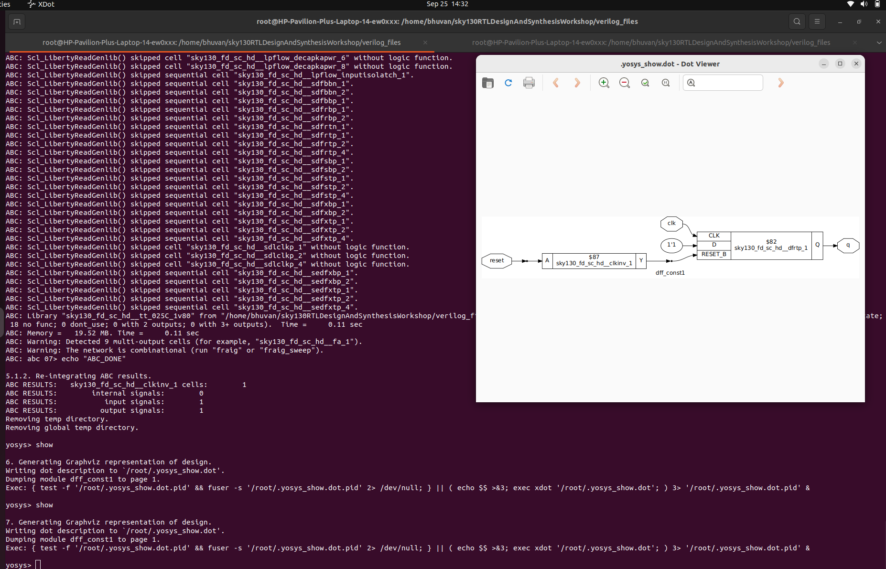
## dff_const2
```
module dff_const2(input clk, input reset, output reg q);
always @(posedge clk, posedge reset)
begin
if (reset)
q <= 1'b1;
else
q <= 1'b1;
end
endmodule

                         _________   
                        |         |                           __    __    __    __    __    __    __    __
       1'b1 ----------->|D       Q|--------->     clk      __|  |__|  |__|  |__|  |__|  |__|  |__|  |__|  |_             
                        |  D-FF   |                        ____________________________    |
           ------------>|>CLK     |              Reset                                 |___|_________________
                        |_________|                        ________________________________|________________
        Reset________________|                   q         

```

But for this code the q is going to be 1 every where as where reset is high we are assigning 1 to it so every where its going to be 1 irrespective of clk and reset. \
Lets see the output waveform.

The out put synthesis is optimised into a single block because any instant of clock or reset the output is 1 so it is optimised to a single block


## dff_const3

```
module dff_const3(input clk, input reset, output reg q);
reg q1
always @(posedge clk, posedge reset)
begin
if (reset)
begin
q <= 1'b1;
q1 <= 1'b0;
end
else
begin
q1 <= 1'b1;
q <= q1
end
endmodule

       Reset  __________________________________________
                         ____|____                  ____|____                             __    __    __    __    __    __    __    __
                        |    V    |                |    V    |                clk      __|  |__|  |__|  |__|  |__|  |__|  |__|  |__|  |_    
       1'b1 ----------->|       Q1|--------------->|        Q|---------->              ____________________________    |     |
                        |  FF-A   |                |  FF-B   |                Reset                                |___|_____|___________
       CLK----|-------->|>        |      |-------->|>        |                                                         |_____|___________
              |         |_________|      |         |_________|                Q1       ________________________________|     |
              |__________________________|                                             ________________________________|     |___________
                                                                              Q                                        |_____|
```             
Lets see that one part where the negative has come and lets see the reason

```
           __    __    __    __
clk    |__|  |__|  |__|  |__|
       _____    |     |
reset       |___|_____|___________
                |  ___|___________
Q1     _________|_|   |   
       _________|     |___________
Q               |_____|
```
The small negativi at Q is because of there will be a small delay of Tcq at Q1 when itt is going from low to high due to reset which makes 0 at that instant so as Q = Q1 the Q also became 0 till the next positive clk pulse after that outpt Q is 1. \
This is the reason the synthesis can not be optimised. \
Output Wave


## dff_const 4&5
 
 Code
 
 
 dff_const 4 output and optimised block
 
 

 dff_const 5 output and optimised block
 
 


</details>
  <details>
<summary>Sequential Optimisation unused output</summary>

## understanding un used output 
```
                                                    ----------- 
                                                   |  Binary   |
           reset                                   |Q2 |Q1 |Q0 |
             |                                     |---|---|---|
         --------                                  | 0 | 0 | 0 |-- 
        |        |            |-----[2]--| un      | 0 | 0 | 1 |  |
        |3-bit UP|------/-----|-----[1]--| used    | 0 | 1 | 0 |  |
        | Counter| count[2:0] |-----[0]--->Q       | 0 | 1 | 1 |  |
        |        |                                 | 1 | 0 | 0 |  |--->The Q0 is toggling on every clk cycle
         --------                                  | 1 | 0 | 1 |  |    and Q1 and Q2 are unused in code
             |                                     | 1 | 1 | 0 |  |    [because of funcnality of code]
            clk                                    | 1 | 1 | 1 |  |
                                                   | ......... |  |
                                                   | ......... |--                 
                                                    -----------

module counter_opt (input clk, input reset, output q)
reg [2:0] count;
assign q = count[0]; 
#we are assigining only q0 for the output
always @(posedge clk, posedge reset)
begin
if(reset)
count <= 3'b000;
else
count <= count + 1;
end endmodule
```
Example \
case 1---q = count[0]  

In case 1 iam least bothered about q1 and q2 as we assigned q0 but in case 2 we are considering both q1 and q2 as it is assigning 3bits of data so all areused in case 2 but not in case 1.

When synthesised the Dff q out is connected to a inverter and connected to input D as we are using only one bit and it is toggling which is connected to the input. So the unused inputs are optimised because they are not having direct connection with primary outputs. So any login which is not resulting in direct connection with primary outputs then they are optimised

 
 
 
case 2---q = (count[2:0] == 3'b100); 
```

module counter_opt (input clk, input reset, output q)
reg [2:0] count;
assign q = (count[2:0] == 3'b100); 
#we are assigining only q0 for the output
always @(posedge clk, posedge reset)
begin
if(reset)
count <= 3'b000;
else
count <= count + 1;
end endmodule
```
so when we use the case 2 we are using all the 3bits for generating output so every bit used so no optimisation is done like case 1

 

</details>
</details>
<details>
<summary>Day_4</summary>
<details>
<summary>GLS & Synthesis Simulation Mismatch</summary>

## GLS(Gate Level Simulation) 

When we are writing the RTL code we validated the functionality of RTL code by testing it we gave some stimulus to the RTL design and check weather output is comming as per our specification or expectation this setup is called TEST BENCH. \
Noow what we are going to do is we are going to run the test bench with the netlist as the design under the test. Originally when we ran the simulation RTL was the design under test and the testbench is injecting the stimulus into the desig ununder test and the design was generating the outputs which we are checking. \
But in GLS we are going to run the test bench with Netlist as design under test. \
The Netlist is logically same as the RTL code because what we wrote as RTL code or behaviour model of design that got converted into the standart cell gates and came out as Netlist. The inputs and the outputs what exsist in the RTL code and Netlist are same.  
So the netlist will seemlessly fit in the test bench. we are simply replacing RTL code with Netlist and going to run the simulation by invoking the simulator by invoking the simulator.

WHY GLS? \
Verifying the logical correctness of design after synthesis. \
Ensuring the timing of the design is met. When we want to run GLS for ensuring the timing is met we need to run it with delay annotation.

## GLS using Iverilog
```
      Design-----------------|
                             |
      Gate level Models------|----->Iverilog Simulator---->.vcd file----->gtkwave---->Output Wave form
                             |                              
      Test Bench-------------|
```
Here Design is Netlist and netlis having std cells instanteated in it what is this std cells(and2 etc..) we have to tell it to the Iverilog which is given by gate level models and then flow is as shown above. \
IF the Gate level Models are delay annotated then we can use GLS for timminng validation. \
The Gate level Models should be timming aware but We are using basic GLS which are not timming aware.
```

            ------
A ---------|       \          \------\                    
           |        |-----------\      \
B ---------|       /             \       \__________ Y
            ------               /       /
C ------------------------------/       /
                               /-------/

```
1. In RTL we used to write \
   assign Y = (a & b) | c; 
2. But in netlist \ 
   and u_and (.a(a), .b(b), .Y(io)); \
   or u_or (.a(io), .b(c), .Y(Y)); \
we dont know what is and or etc so we need tell what is this meaning of and or etc this information is present in Gate level verilog model \
Gate level verilog model can be 
    1. Timing aware--->we validate functionality + Timming 
    2. Functional----->if just functional we can validate the functionality

As Netlist and RTL are same but we perform functionality verification because ther eare chances of simulation and synthesis mismatch.

## Synthesis Simulation Mismatch

change in input then change in out put if no change simulator does not evaluate the input
1. Missing sensitivity List
 ```  
   module mux (
   input i0, input i1,                      |\
   input sel;                               |  \
   output reg y);                   io ---->|    \
   always @(sel)-->This is blunder          |     |
   begin                                    |     |---> Y
   if(sel)                                  |     |
   y = i1;                          i1 ---->|    /
   else                                     |  /| 
   y = i0;                                  |/  |
   end                                          |
   endmodule                                   sel
   

               ___________
sel __________|           |____________
       __    __         _____
io  __|  |__|  |_______|     |_________
           ___       ___          __
i1  ______|   |_____|   |________|  |___
```

The always block is only evaluating when select is changing if select is not changing the always block is not evaluated irrespective of change in i0 or i1. So when there is change in input output  Y is not getting evaluated only output is evaluated when change in select line only so this is like latch. But for us thw output should be evaluated when there is change in inputs also.
```
   module mux (
   input i0, input i1,                            |\
   input sel;                                     |  \
   output reg y);                         io ---->|    \
 always @(*)-->Now every change is evaluated      |     |
   begin                                          |     |---> Y
   if(sel)                                        |     |
   y = i1;                                i1 ---->|    /
   else                                           |  /| 
   y = i0;                                        |/  |
   end                                                |
   endmodule                                         sel
   

               ___________
sel __________|           |____________
       __    __         _____
io  __|  |__|  |_______|     |_________
           ___       ___          __
i1  ______|   |_____|   |________|  |___
```
By changing the always block now always will be evaluated when any change in signal is occured. So now change in i0 and i1 also get evaluated.

2. Blocking and Non_Blocking statements in verilog

   Blocking and Non blocking can only be used in always block

   If = is used it is Blocking statement
   It is executes the statements in the order it is written. So the first statement is evaluated before the second statement. Here bhevaour is like C programm.

   If <= is used it is Non Blocking
   It executes all the RHS when always block is entered and assigned to LHS. Oder does not matter as parallel evaluation is done as they execute RHS first.


Aim is to create 2bit shift register

```
       Reset  __________________________________________
                         ____|____                  ____|____                           
                        |    V    |                |    V    |                
          D ----------->|       Q1|--------------->|        Q|---------->    D should go to q0 next q0 to q
                        |  FF-A   |                |  FF-B   |               
       CLK----|-------->|>        |      |-------->|>        |               
              |         |_________|      |         |_________|               
              |__________________________|       


module code (input clk, input reset,
input d;
output reg q);
reg q0;
always @(posedge clk, posedge reset)                    Reset  __________________________________________
begin                                                                     ____|____                  ____|____ 
if (reset)                                                               |    V    |       q0       |    V    |   q 
begin                                                      D ----------->|       Q0|--------------->|        Q|----------> 
q0 = 1'b0;                                                               |  FF-A   |                |  FF-B   |               
q = 1'b0;                                               CLK----|-------->|>        |      |-------->|>        |               
end                                                            |         |_________|      |         |_________|         
else                                                           |__________________________|       
begin
q = q0;  -----> First q0 is assigined to q first 
q0 = d;  -----> Next d is assigined to q0 next this is how the bloking works step by step
end
endmodule
```
Here 2 storages are done.
```
module code (input clk, input reset,
input d;
output reg q);
reg q0;
always @(posedge clk, posedge reset)                    Reset  _______________
begin                                                                     ____|____     
if (reset)                                                               |    V    |    
begin                                                      D ----------->|       Q0|------->Q 
q0 = 1'b0;                                                               |  FF-A   |                   
q = 1'b0;                                               CLK------------->|>        |                   
end                                                                      |_________|           
else                                                                  
begin
q0 = d;  -----> First d is assigined to q0 first 
q = q0;  -----> Next q is assigined to q next this is how the bloking works step by step
end
endmodule
```
As q0 = d so the data of d is stored to q0 next q = q0 which means data of q0 is stored to q simply it is q = d as q0 is assigned before q is assigned so it makes a single flip flop which does not reach the expected output

If we use nonblocking the oder does not matters it can be in any format
```
q0 <= d;     q <= q0;
q <= q0;     q0 <= d; 
```
They both are same they produce 2bit shifter only. \
So moral use non blocking for for writing sequential circuits. 

Aim to create circuit like below
```            
            \------\                                           
A ----------->\      \               
               \       \      q0     ------ 
                )       ) --------->|       \
               /       /            |        |----->Y
B ---------->/        /       C---->|       /
            /-------/                ------
             OR GATE                 

module code (input a,b,c
output reg y);
reg q0;
always @(*)
begin
y = q0 & c;----> as q0 is not assigned before so it takes previous value of q0 like FF but when synthesised FF is not given
q0 = a | b;----> now q0 is updated with or logic of a and b so q0 can not be used before
end
endmodule

module code (input a,b,c
output reg y);
reg q0;
always @(*)
begin
q0 = a | b;---> qo is computed first which as or logic 
y = q0 & c;---> now q0 uses new value of q0 as it is synthesised first
end
endmodule

```
Both gives same circuit but for first old value of q0 is used but for second latest value of q0 is used. \
To avoid this type of issues run GLS on netlist to check the bhevaour of the cicuit and match with expected output as no mismatches.

</details>
<details>
<summary>Lab on GLS and Synthesis and Simulation mismatch</summary>

## Labs on GLS
Ternary operator MUX
```
module ternary_operator_mux (
input i0 , input i1 , input sel , output y);
assign y = sel? i1 : i0;
endmodule
```
Lets check basic RTL output of the ternary_oprator_mux.v
commands to check basic output wave form.
```
iverilog ternary_operator_mux.v tb_ternary_operator_mux.v
./a.out
gtkwave tb_ternary_operator_mux.vcd
```

 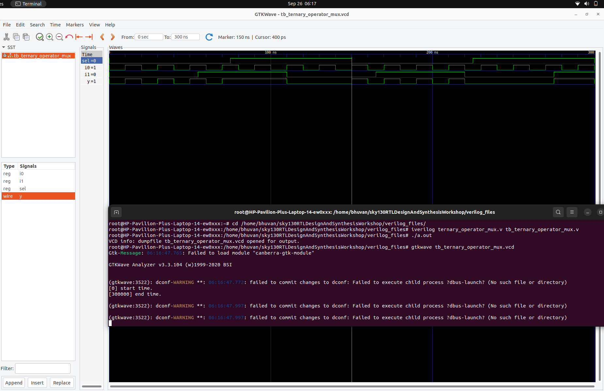

And synthesis of the ternary_operator_mux.v
commands to check synthesis 
```
read_liberty -lib ../lib/sky130_fd_sc_hd__tt_025C_1v80.lib
read_verilog ternary_operator_mux.v
synth -top ternary_operator_mux
abc -liberty ../lib/sky130_fd_sc_hd__tt_025C_1v80.lib
show
write_verilog -noattr ternary_operator_mux_net.v
```
 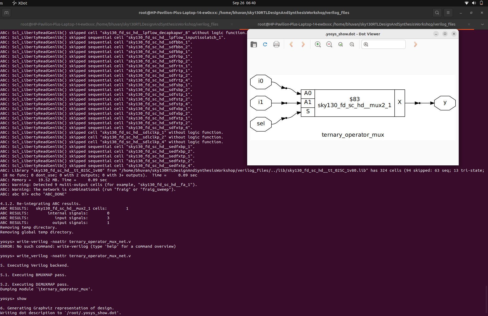
 
The above mentioned graph is a RTL graph but to get the GLS output we have to run the below commands
```
iverilog ../my_lib/verilog_model/primitives.v ../my_lib/verilog_model/sky130_fd_sc_hd.v ternary_operator_mux_net.v tb_ternary_operator_mux.v
# we have to add the above .v files for GLC simulation and next add Netlist and Testbench (test bench is same for both the RTL and Netlist) 
./a.out
gtkwave tb_ternary_operator_mux.vcd
# observe the output put wave for 
```
 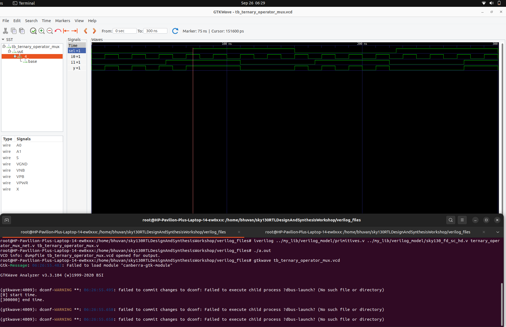
 
From the image we can say that it is a GLS simulation because for GLS under tb_ternary_operator_mux.v there will be uut undert that there are gate level instants but for RTL under tb_ternary_operator_mux.v this there will be a uut under that there will nothing by this we can says its a RTL simulation.

## synthesis and simulation mismatch 
Lets take the code
```
module bad_mux (input i0 , input i1 , input sel , output reg y);
always @ (sel)
begin
	if(sel)
		y <= i1;
	else 
		y <= i0;
end
endmodule
```
In the above code as we can see the always block executes only when selction line has a change if there is change in the inputs or not. so this is simulation errorr. \
Lets see the simulation output of the above code. 

 
 
As we can see that when there is change in the input lines but there is no chnage in output line this is because the always block is executed only when selction is change this is the simulation error. So when select line is high it takes starting stage of i1 and give as output but when selection line is low it takes starting stage of i0 and gives as output. \
The working is simply like a latch but when synthesised it doesnot give the latch but gives only mux this is synthesis mismatch
 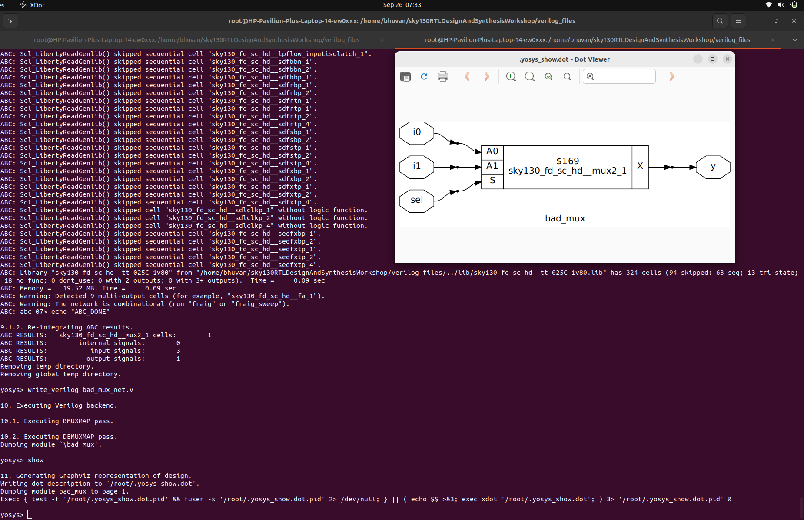
 
But when runned the GLS using the below commands
```
iverilog ../my_lib/verilog_model/primitives.v ../my_lib/verilog_model/sky130_fd_sc_hd.v bad_mux_net.v tb_bad_mux.v
./a.out
gtkwave tb_bad_mux.vcd
```
We can se that its giving the exact output of mux this is what we call simulation miss match.
 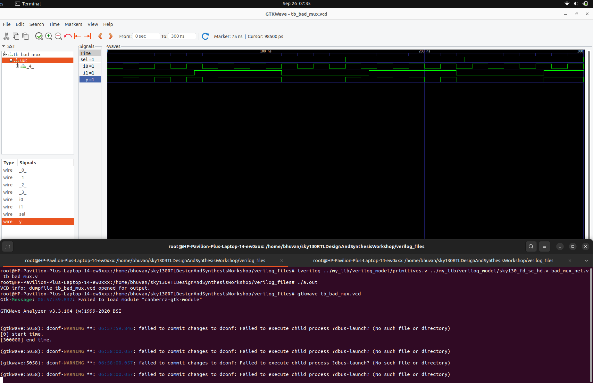

## Example of blocking statement
Lets see the another examle of blocking statement synthesis and simulation mismatch which we disscused before
```
Aim
            \------\                                           
A ----------->\      \               
               \       \      q0     ------ 
                )       ) --------->|       \
               /       /            |        |----->Y
B ---------->/        /       C---->|       /
            /-------/                ------
             OR GATE                 

module blocking_caveat (input a , input b , input  c, output reg d); 
reg x;
always @ (*)
begin
	d = x & c;
	x = a | b;
end
endmodule
```
Lets see the RTL simulatiomn with commands

```
# commands
iverilog blocking_caveat.v tb_blocking_caveat.v
./a.out
gtkwave tb_blocking_caveat.vcd
```
Waveform

 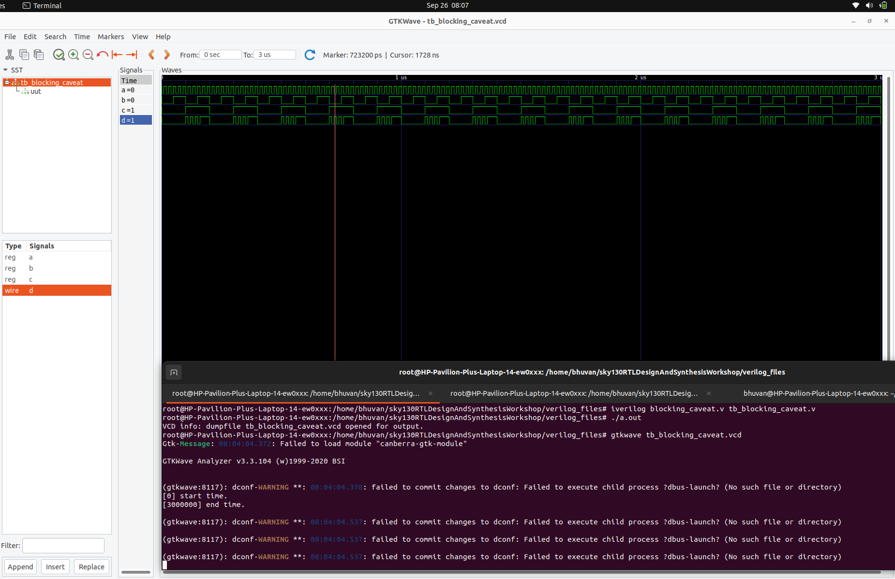
 
Lets see synthesis with commands
```
# commands
read_liberty -lib ../lib/sky130_fd_sc_hd__tt_025C_1v80.lib
read_verilog blocking_caveat.v
synth -top blocking_caveat
abc -liberty ../lib/sky130_fd_sc_hd__tt_025C_1v80.lib
write_verilog -noattr blocking_caveat_net.v
show
```
synthesis

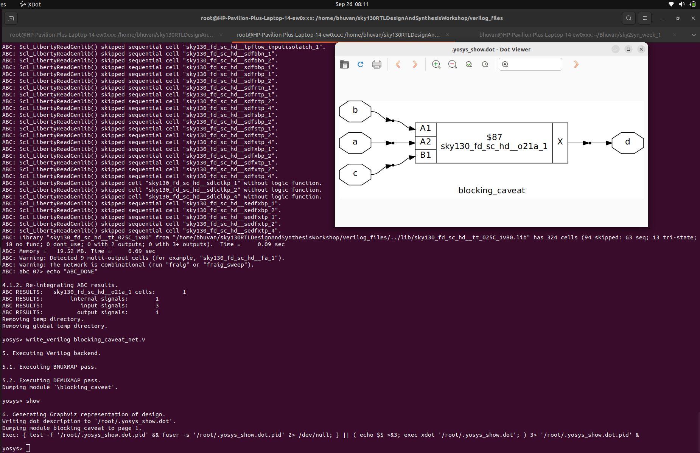

Lets see GLS with commands
```
# Commands
iverilog ../my_lib/verilog_model/primitives.v ../my_lib/verilog_model/sky130_fd_sc_hd.v blocking_caveat_net.v tb_blocking_caveat.v
./a.out
gtkwave tb_blocking_caveat.vcd

```

Waveform

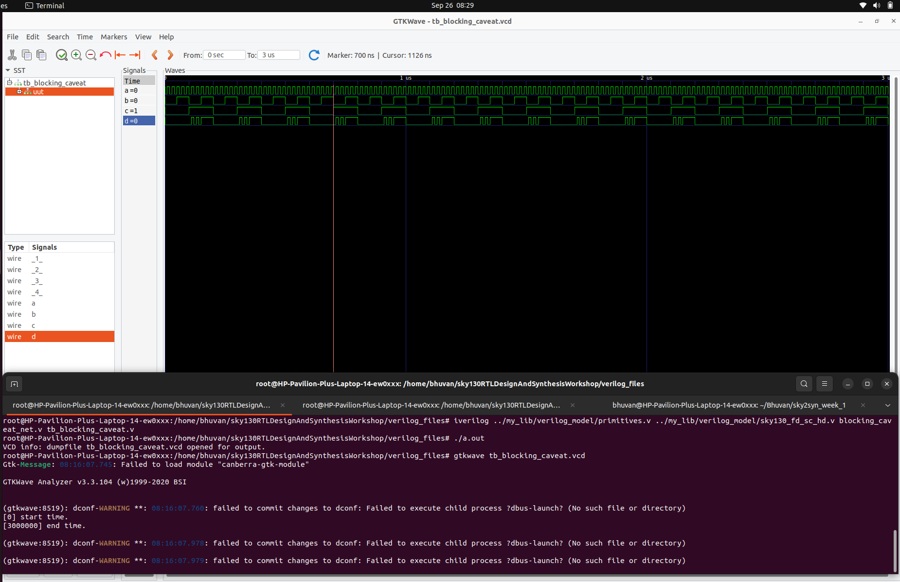

NOTE:- Dont using blocking assigment prefer non blockin if using blocking use with atmost care and run the circuit because there are chances of simulation and synthesis mismatch

</details>
</details>
<details>
<summary>Day_5</summary>
<details>
<summary>IF Case Construct</summary>

## If[used in always block]
If is mainly used to create priority logic. \
It should be used in always block and variable we are trying to assign to the if must be register variable.
```
syntax
if <condition>         if <condition 1> 
begin                  -----(c1)
----                   -----
----                   else if <condition 2>
end                    -----(c2)
else                   -----
begin                  else if <condition 3>
-----                  ---- (c3)
-----                  ---- 
end                    else
                       ----(e)
                       ----
```
Lets see how the code works
First if is evaluated if the if block condition is not satisfied it go to else if if this block also not satisfied it goes to else if 2 and soo on and if all the blocks conditions are not satisfied then finally else is executed. \
Lets see how the hard ware looks like 
```
      |\                            
      |  \                              
e---->|0   \      |\                                                  
      |     |     |  \           
      |   Y0|---->|0   \          |\
      |     |     |     |         |  \ 
c3--->|1   /      |   Y1|-------->|0   \ 
      |  /|       |     |         |     |
      |/  |   C2->|1   /          |    Y|----> Y     
          |       |  /|           |     |    
     Condition 3  |/  |      c1-->|1   /   
                      |           |  /|
                  condition 2     |/  | 
                                      |
                                 condition 1
```
                      
## Danger/caution with if => INFERED LATCHES
Infered latch is bad coding style which comes with incomplete IF statement
```
                                     ___________________________                                                            
                                    |     |\                    |        
								    |     |  \                  |            
if <condition 1>				    |---->|0   \      |\        | 
y = a;								      |     |     |  \      |     
else if <condition 2>					  |   Y0|---->|0   \    |      
y = b;									  |     |     |     |   |      
# no else block is intialised		b---->|1   /      |   Y1|---|----->
								          |  /|       |     |         
										  |/  |   a-->|1   /         
    									      |       |  /|         
										 Condition 2  |/  |     
										                  |         
													  condition 1     
```
If we dont say what to do if both the conditions are not satisfied so it will latch with output and try to retain the value of y
```	                       
                                                                                                                     
                                                                                           
                              __________________________________                                                            
                             |            |\                    |        
						     |	          |  \                  |            
			               LATCH--------->|0   \      |\        | 
OR of COND1 and COND2------->|		      |     |     |  \      |     
	                                      |   Y0|---->|0   \    |      
								          |     |     |     |   |      
                	                b---->|1   /      |   Y1|---|----->
								          |  /|       |     |         
										  |/  |   a-->|1   /         
    									      |       |  /|         
										 Condition 2  |/  |     
										                  |         
													  condition 1   
```
A latch is introduced as there is incomplete statement so for latch to turn on the OR logic of cond1 and cond2 is required which means when the both the conditions are false the latch is gona turn on. 

This is infered latch which comes when there is incomplete latch

## Case[used in always block]
It should be used in always block and variable we are trying to assign to the case must be register variable. \
syntax
```
reg y
always @(*)
begin
case (sel)
  case1:
  begin
  ----(c1)
  end
  case2:
  begin
  ----(c2)
  end
  case3:
  begin
  ----(c3)
  end
  default:
  ....
  ....
end case
end
```
### Caveats with case
1. Incomplete case => infered latches \
   solution is code case with defaul so lets see how.
```   
case [1]               case[2]

reg [1:0]
always @(*)
begin
case (sel)            case (sel)
  2,b00:                 2,b00:
  begin                  begin
  ----(c1)               ---(c1)
  end                    end
  2'b01:                 2'b01:
  begin                  begin
  -----(c2)              ----(c2)
  end                    end
endcase                  default:
end                      endcase
```
In case 1 we specifed only 2 inputs as it is having 2 select lines it generate 4 inputs but we only gave 2 so remaining will get latched but in case 2 as we used default the remaining 2 inputs will be assigined with default values which avoides laching of the design.

2. Partial assignments in case 
```                                 
reg [1:0]sel;                                                 |\  
reg x, y;                                                     |  \ 
always @ (*)                                            a---->|0   \  
begin                                                   c---->|1    |  
case (sel)                                               |--->|2   X|---->
  2'b00:                                           d---->|    |     |
  begin                                                  |--->|3   /
  x = a; we assigned x and y in for 00                        |  /|
  y = b;                                                      |/  | 
  end                                                             |----sel
  2'b01:                                                      |\  |
  begin                                                       |  \| 
  x = c; but we only assigned x not y for 01            b---->|0   \ 
  end                                               Latch---->|1    |  
  default:                                               |--->|2   Y|---->    
  begin                                            b---->|    |     |   
  x = d; expect those cases we assigned x and y          |--->|3   /    
  y = b;                                                      |  /
  end                                                         |/ 
endcase                                                     
end                                                                   
```                                   
So from the above code we can say that for 0 x and y both are assigined but for 1 we only assigined x but not y so now the 1 of y is going to get infered latch this is the problem if we included default also but we missed one of the input this will cause error of infered latch. \
So assign all the outputs in all the segments of the case.

3. Over laping case statements
```   
if we write                     
priority high to low               
| if 
| else if 
| else if 
| else 
V 
only one portion can be executed all can not be executed. Once one is executed the always block will be ended 


if we write case like this
Execution of every block 
| 2'b00:
|.... 
| 2'bo1: 
|.... 
| 2,b10: 
|.... 
| 2'b1?: //hear question mark takes any value 0 or 1 
|.... 
V
```
supose if we take 10 both 3 and 4 will be executed as ? takes any value so in this case it runs one by one if one is executed it will not end the always block it will execute every case statement and then it quits. \
So when we are writing cases there should be no overlaping like above example.

</details>
<details>
<summary>Labs on incomplete if</summary>

## Incomplete if_1
```

module incomp_if (input i0, input i1, input i2, output reg y);         _____________                                                            
always @ (*)                                                         |     |\        |                 ___________
	begin							                                 |     |  \      |                |           |
    if (i0)			                                                 |---->|0   \    |        i1 ---->| D       Q |----->
    y <= i1;							                                   |     |   |                |           |
end 				                                                       |   Y |---|-> Y =>         |           |
endmodule									                               |     |                    |           |
                                                                    i1---->|1   /             i0 ---->|EN         |
								                                           |  /|                      |___________|
										                                   |/  |                         D-LATCH
                                                                               |            
										                                       i0     
										                                                       
```													                                       
As the else block is not assigined then the unconnected input 0 is geting latched and its now simpply loking like a D-LATCH. \
so lets check wave form.
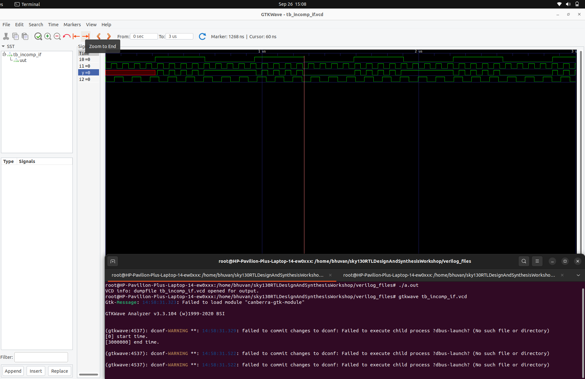
 
From simulation we can say that when ever the select line goes low it following the constant out either 1 or 0 and when ever its going high its following i1 this how the the we can say incomplete if statement.

Lets check the synthesis
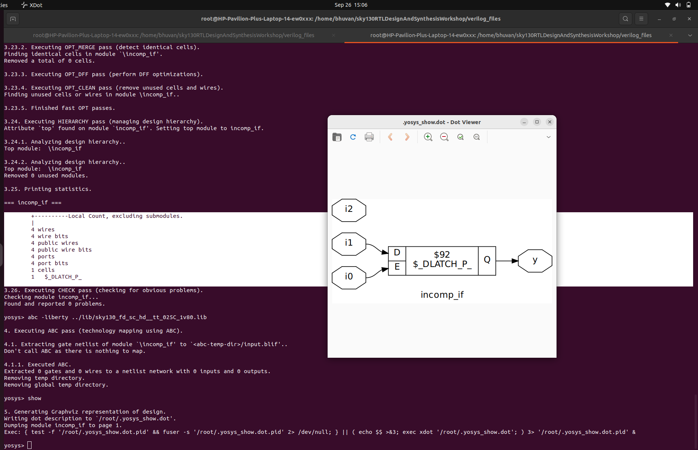

Our aim is code the mux but it is syntesised to a D-Latch (check the highlighted part). This is because of the incomplete if statement.

## Incomplete if_2


```
                                     ___________________________                                                            
                                    |     |\                    |        
								    |     |  \                  |            
if <condition 1>				    |---->|0   \      |\        | 
y = a;								      |     |     |  \      |                    _________
else if <condition 2>					  |   Y0|---->|0   \    |              ---->| D     Q |---->
y = b;									  |     |     |     |   |                   |         |
# no else block is intialised	   i3---->|1   /      |   Y |---|----->  ==>        |         |
								          |  /|       |     |                  |--->|EN       |
										  |/  |  i1-->|1   /                   |    |_________|
    									      |       |  /|                    |
										     i2       |/  |            OR of i0 and i2
										                  |         
													      i0  
```


Similarly to incomplete if_1 we know that as there is a no else statement so the mux one input is not connected which is latched with output and OR is used for enabling the D-LATCH only when any of the input is high if both the inputs are low it takes previous state.  


Now lets check the synthesis and simulation output


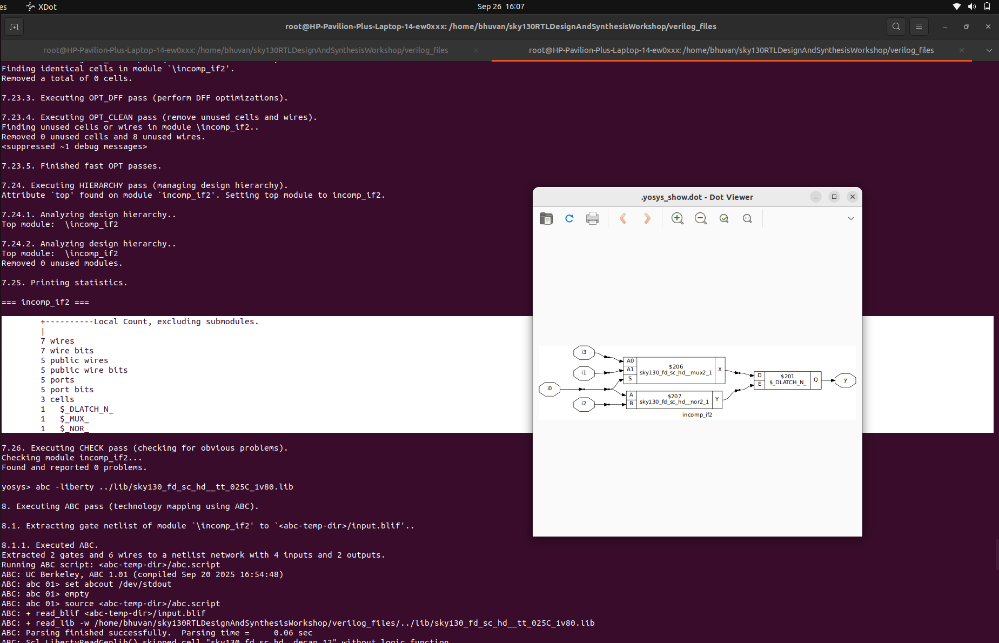


